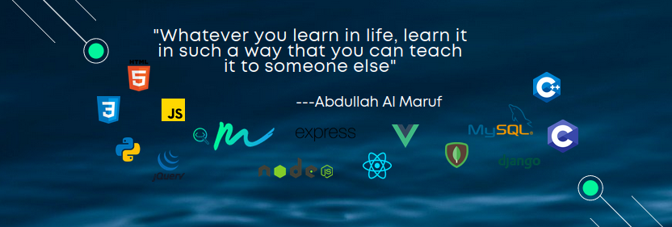

<h1 align="center">Hi 👋 I'm Maruf</h1>
<h3 align="center">A passionate front end developer from Bangladesh</h3>

# YouTube [Channel](https://youtube.com/channel/UCPH3m-f9gmleXkq33G9CZKQ?sub_confirmation=1)

  

  

## Channel PlayList Collection
### 🎯 HTML CSS Projects [PlayList Link](https://youtube.com/playlist?list=PLldSzdV-qgyl49Ua31jI4IPYHEak0LNGs)
### 🎯 Card Design Using HTML and CSS [PlayList Link](https://youtube.com/playlist?list=PLldSzdV-qgynWGtWRtawlGhJvahvXS0-a)
### 🎯 Login Form Design Using HTML and CSS [PlayList Link](https://youtube.com/playlist?list=PLldSzdV-qgyk7WaxOeKMVhvenuMQ3u4TT)
### 🎯 JavaScript DOM Manipulation [PlayList Link](https://youtube.com/playlist?list=PLldSzdV-qgyn1jqLQ406fjJnha_bBAgVn)
### 🎯 Linux Terminal Basic to Advanced [PlayList Link](https://youtube.com/playlist?list=PLldSzdV-qgykjEEzvw_fYK56F2w-5kfV5)
___
<h3 align="left">Languages and Tools:</h3>

                                         

&nbsp;

## Social Media Platform
### 🎯 Follow me on [Facebook](https://www.facebook.com/mdmarufsarker21)
### 🎯 Join our [Facebook Group](https://www.facebook.com/groups/webdesignanddevelopment7)
### 🎯 Github [Profile](https://github.com/marufjs)
### 🎯 Behance [Portfolio](https://www.behance.net/md_marufsarker/)
### 🎯 Quora [Profile](https://bn.quora.com/profile/Md-Maruf-Sarker)
### 🎯 Join Our [Discord server](https://discord.gg/GsayfaVYzN)
### 🎯 Follow me on [Instagram](https://www.instagram.com/md_marufsarker/)
